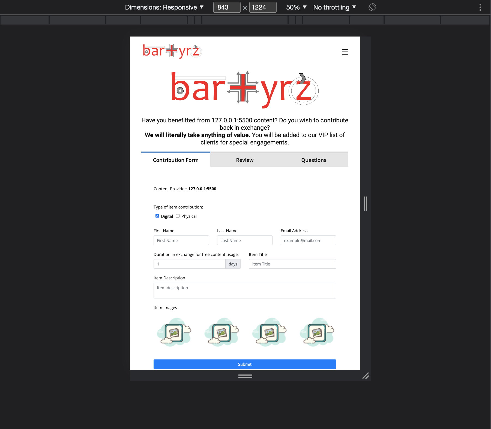
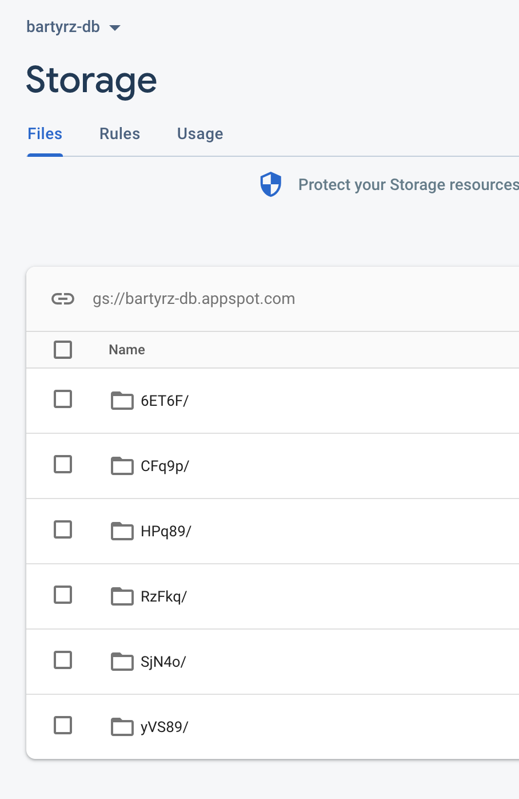

# Bartyrz

- add image upload func to api
- set up firestore and fire storage

- node js server receives null for image file
    - opt1 handle client side
        - pro: works
        - con: "unsafe" server should handle uploads
    - opt2 hadnle with multer or filestream to send
        - pro: client request
        - con: firebase expects raw file, nodejs cant handle raw file, changing file type will get passed to firebase

`file.body [Object: null prototype] { field2: 'stringtext' }`

## images

