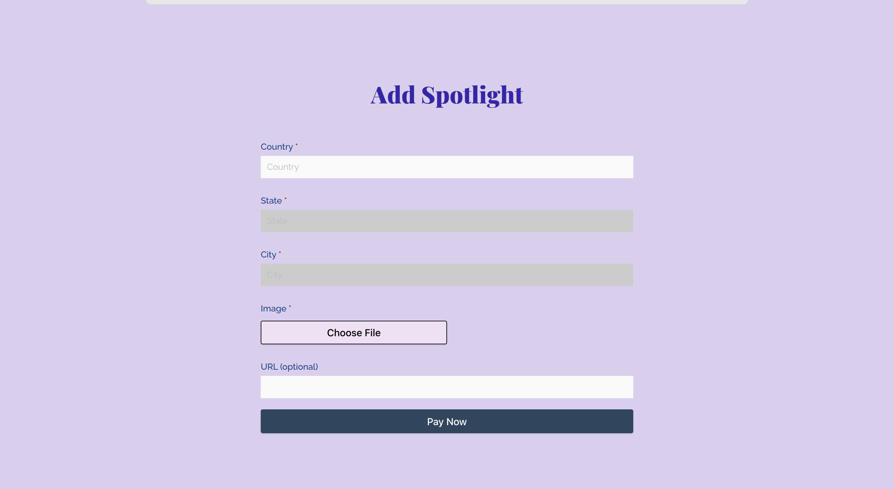
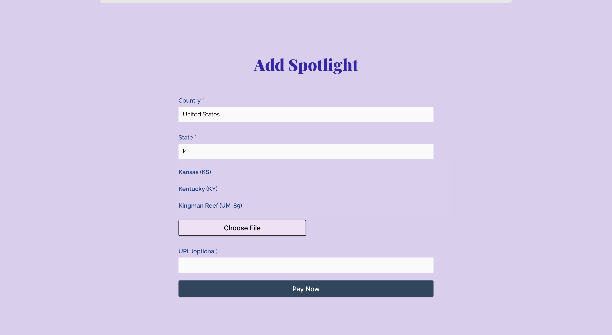
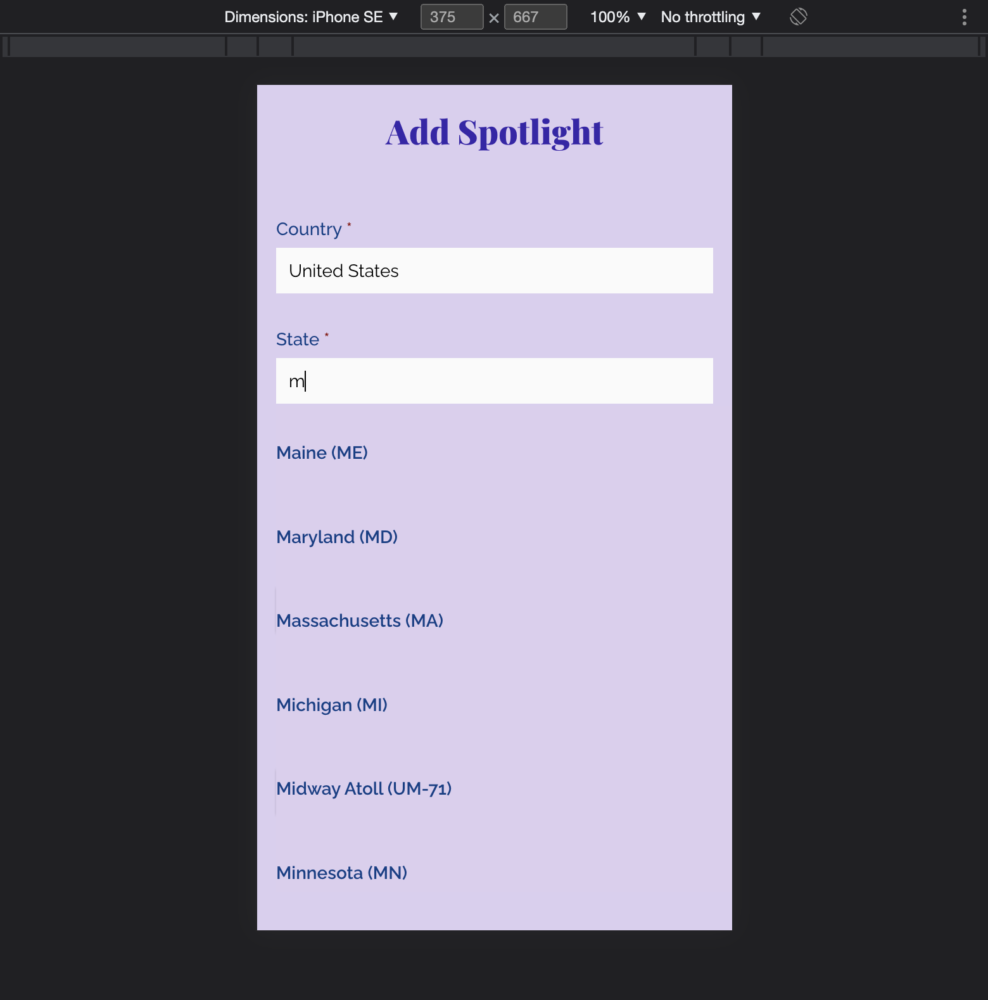

# autocomplete

- pulls from json of country city state options
- regex matches options to start with input entry
- display drop down of matches
- diabled to select in order, to prevent any excess looping
    - one loop through all countries, then save srray of states and citys at each selection

## images
 

