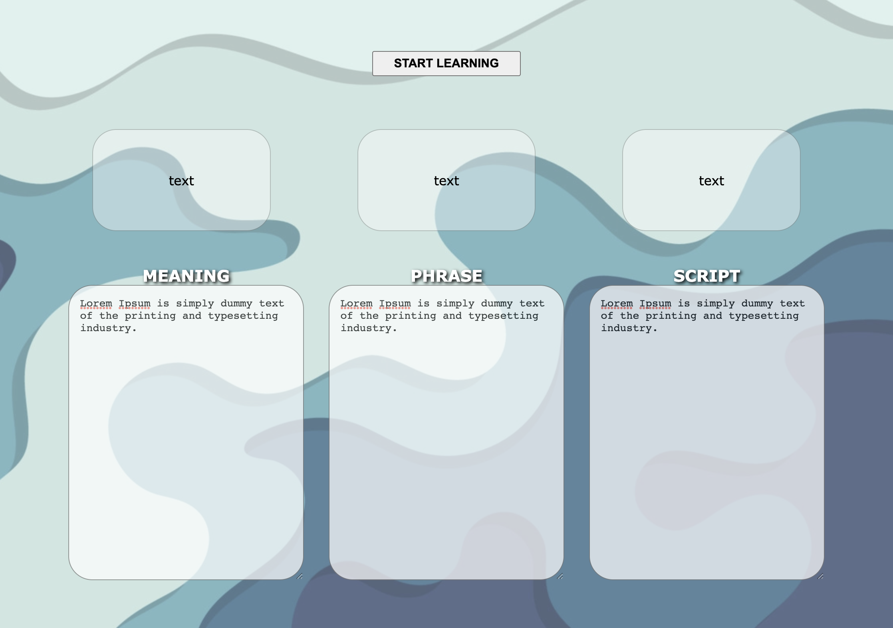
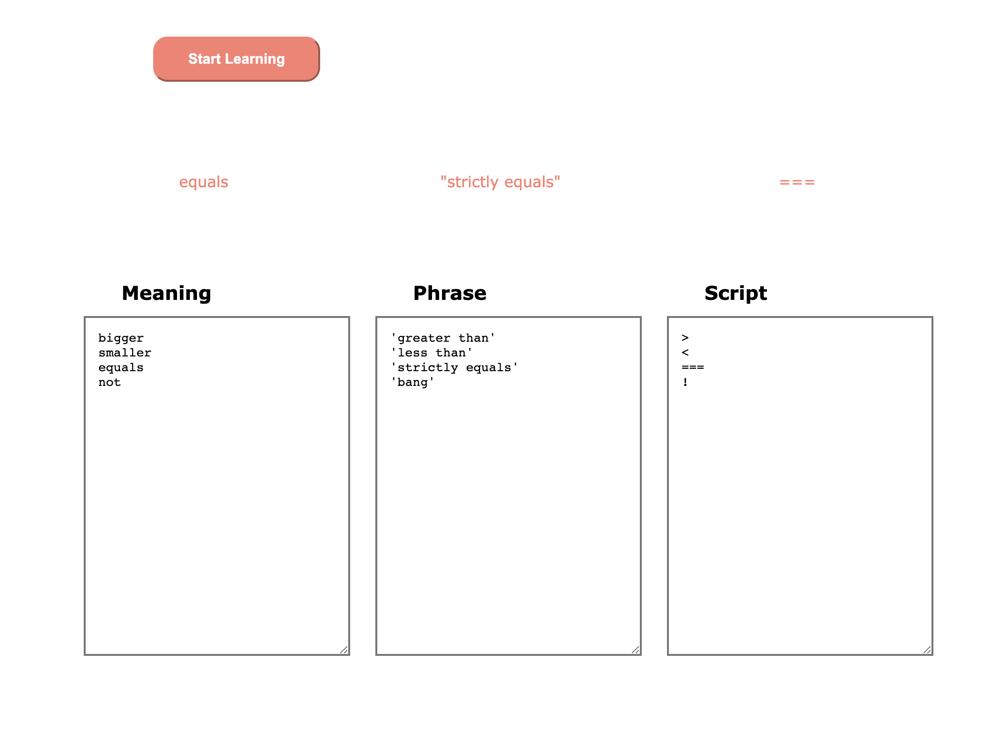

# flashcard study

### V1
- take in 3 user inputs for meaning - phrase - symbol
- parse the inputs by space (single words)
- display 1 set of matching meeaning-phrase-symbol
- cycle through all parsed inputs

### V2
- random input order
- throw error on unequal list length
- grab phrase with regex match single or double quote
- revert styles to white bg

### V3
- display phrase and symbol 2 seconds after meaning

    
    

