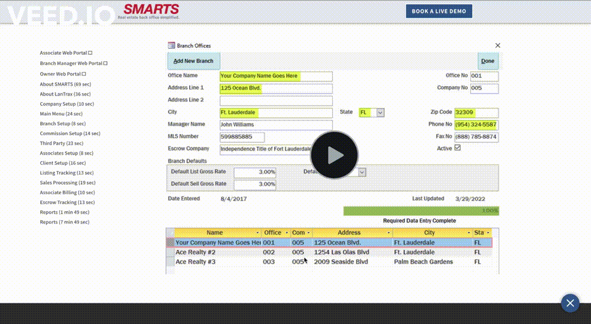
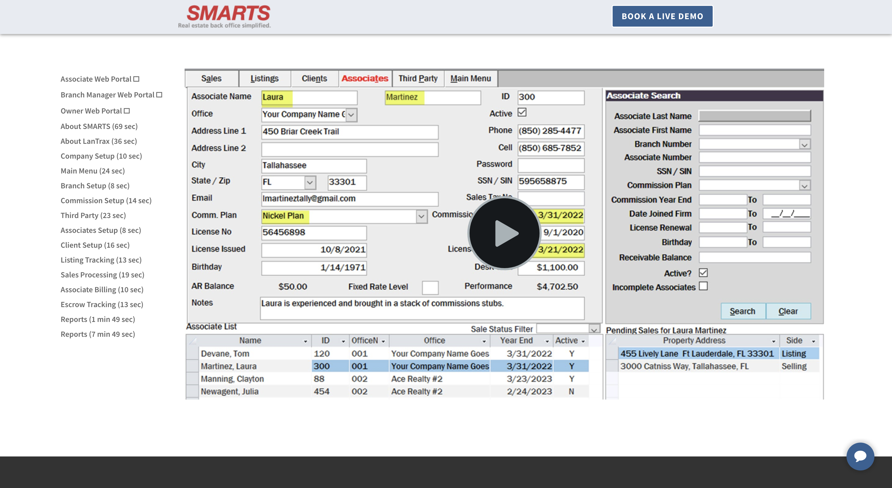

# iframe src
- left side has a menu list of videos to watch
- have each video open in the same iframe, rather than a new tab/window

- give the links a 'target' with the same 'name' as the iframe and have the href an embed link

## demo

## images

