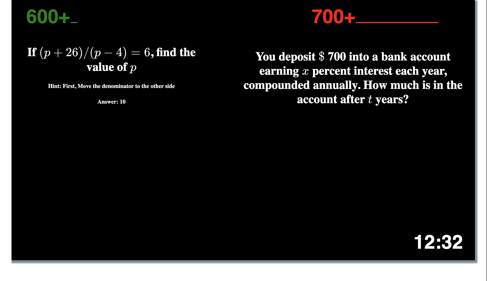

# sat math questions

### V1
- display 2 questions
- seperate files
- offset/delay start of second question by 15 seconds
    - first q up for 45
    - at 30 sec display second question

### V2
- infinite loop quiz-break-quiz
    - one main timer -15min
    - one breaktimer -5min
    - handle timer over a minute
    - count down timer
- two offset questions
    - each new timer func
    - progress bars for each question

