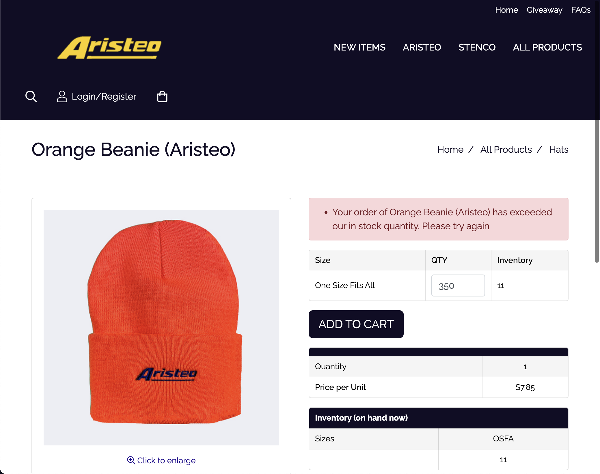

# [Aristeo](https://aristeo.ebloxstoreipu.com)

### 30 nov 2023
### https://aristeo.ebloxstoreipu.com

## description
- ecommerce store management, order inventory error message

## issue:
- Try to add 300 items to the cart and an error message pops up. I want to be able to change the last sentence in the error message if possible
- The last sentence currently says - Please update your quantity to or below the available amount. They just want that to say Please try again

## solution:
- query selector searching for .productTitle (null) updated to h1 product title on page

