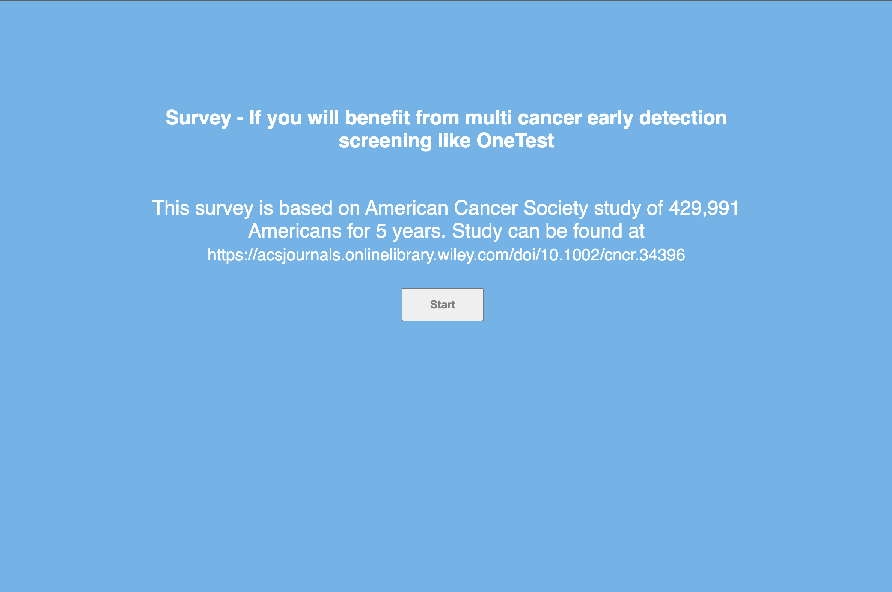
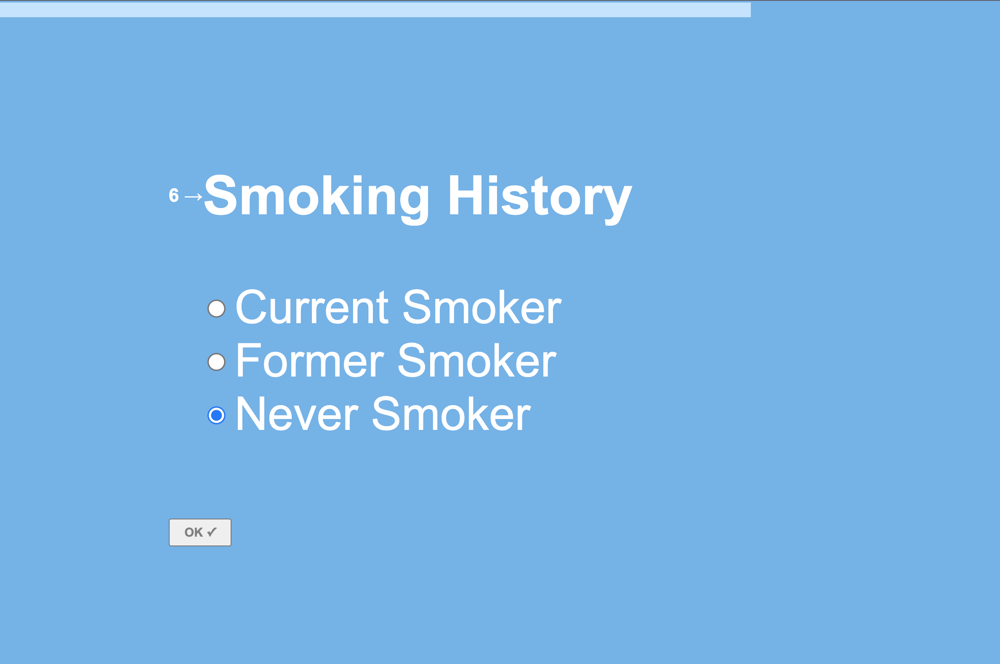
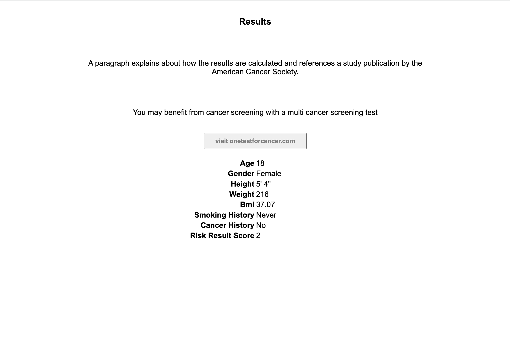

## Cancer risk survey

Prototype can be seen here:  https://form.typeform.com/to/cbhAd7hx

A survey asks questions about a person’s risk factors associated with cancer risk:
	•	Age (number between 18-99)
	•	Gender (Male, Female)
	•	Height (calculate BMI )
	•	Weight (number, between 50-500)
	•	Smoking History: Current smoker, Former smoker, never smoker
	•	Cancer among immediate family members? Yes, No

Risk Score is calculated as follows:
	•	If age is >=50, add 1 to score
	•	Calculate BMI.  If BMI is >27.5, add 1 to score.  If BMI is >30, add 2 to score
	•	If Smoking = Former, add 1 to score, If Smoking = Current, add 2 to score
	•	If Family cancer = Yes, add 1 to score.

Save results in a table.

Results Page:
A results page is displayed

A paragraph explains about how the results are calculated and references a study publication by the American Cancer Society.
Any answers that are associated with elevated cancer risk are shown.

If the score >1, a text paragraph is shown,
 that says they may benefit from cancer screening with a multi cancer screening test
A logo and button are shown that redirect them to our website Onetestforcancer.com.

If the score <=1, a paragraph is shown,
that explains that based on the info they provided, they are not at high risk for developing cancer but cancer screenings as recommended by their physician should still be performed.

## images

