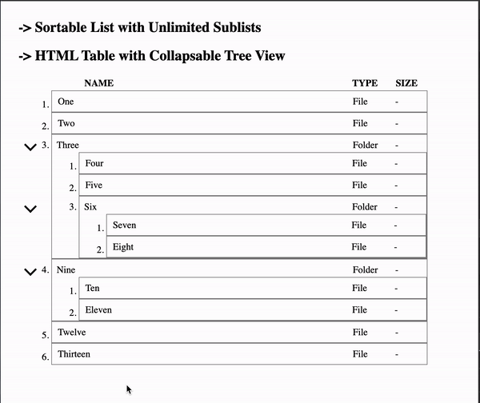
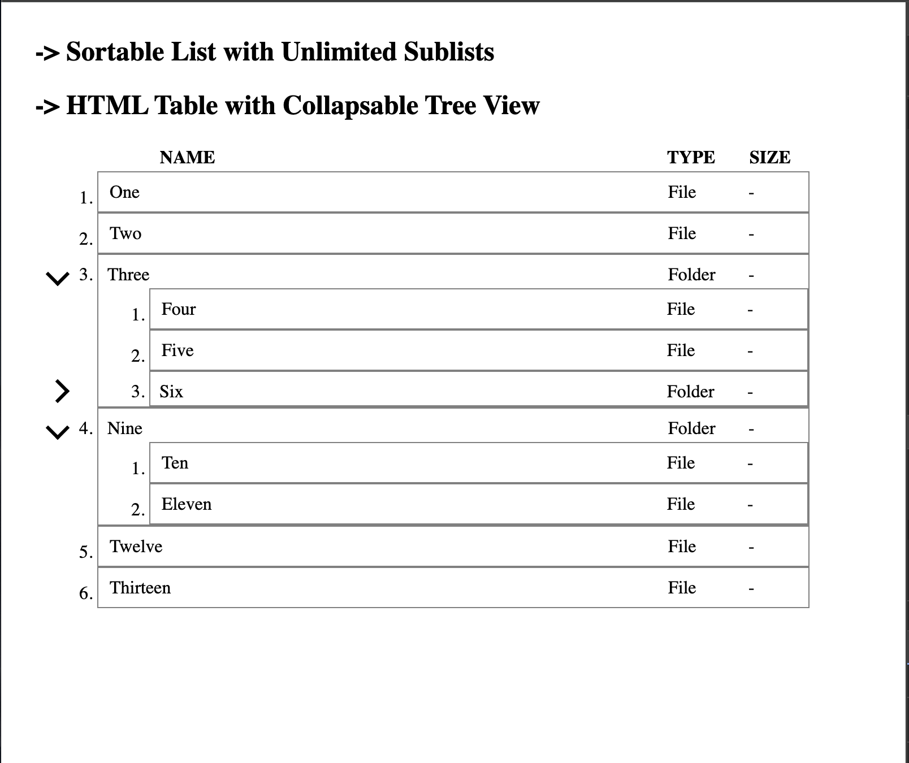

# Dragagble Nested Tree
## Draggable HTML Table with Nested Tree View & unlimited sublists

- jquery-sortable
- ol is only drop target, render all li with empty ol for unlimited drop targets

- I have a requirement wherein i need a tree within html table, and i need that table rows as draggable so that any row can be dragged to move in any tree node.
- I am looking for this code using html, css and javascript to make tree nodes and draggable row
- and consider that i can drag any node or row to another node or parent, so expecting that it should go and sit as child
- Can you please create the HTML table where we have more than 1 column? as tree view, where I can collapse and expand the node (to hide and show child nodes)

