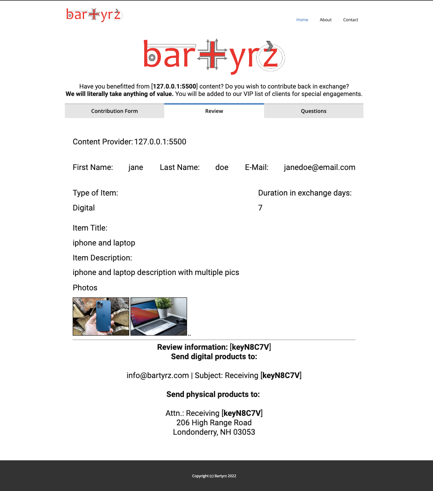
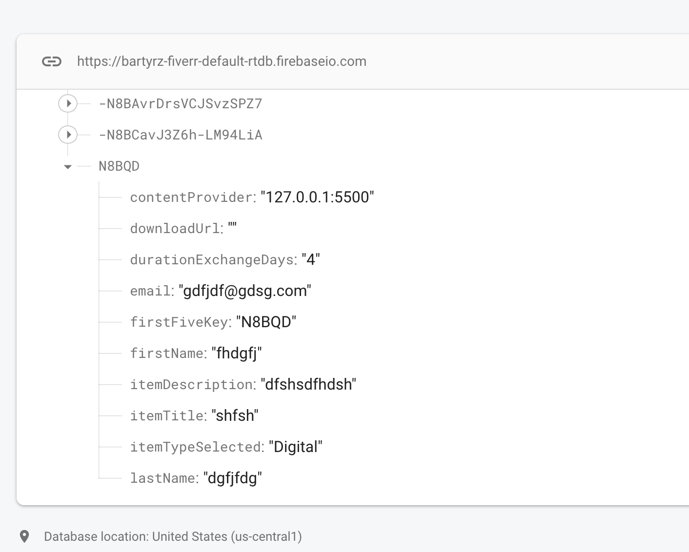
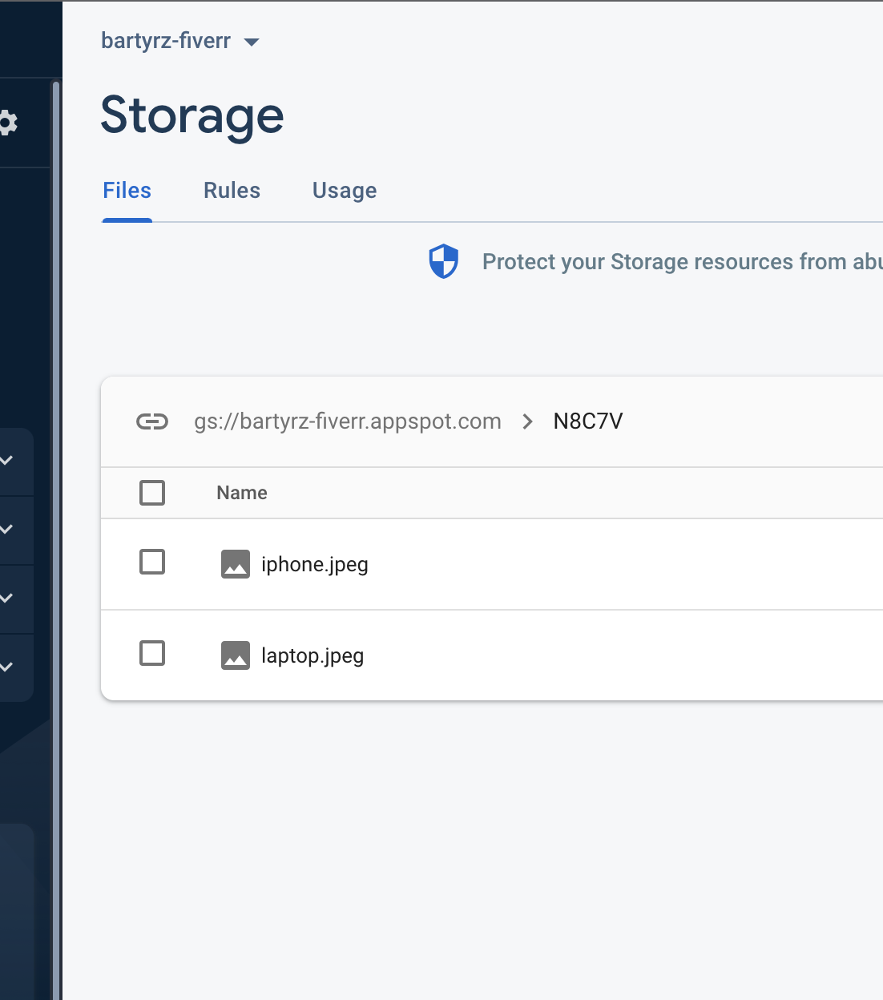
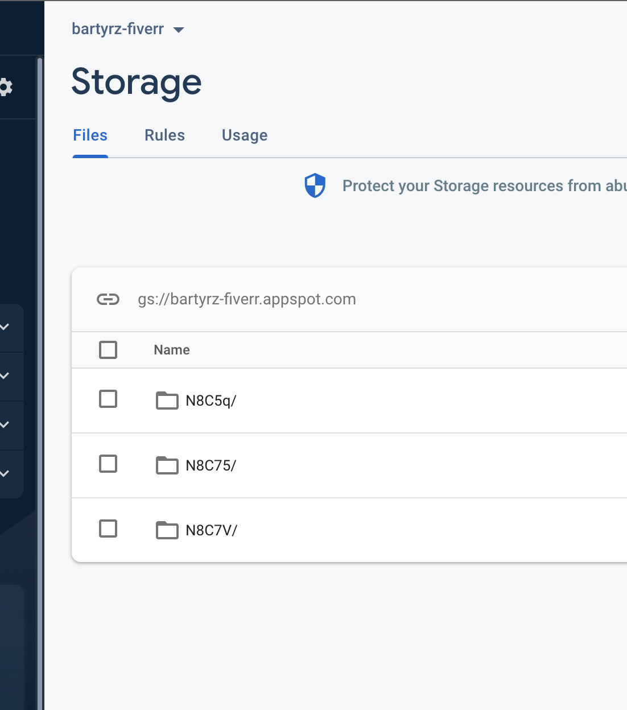

# bartyrs
## firebase survey form

- submission form with validation
- sent to firebase realtime database with optional photo upload to firebase storage.
-  when form is submitted, it uploads the photo to storage,
- gets a download url and saves to the database with the rest of the data,
- and when finished then activates the review tab.

- upload up to 4 pictures
- display all info on review tab
- display pictures in review tab

## images

