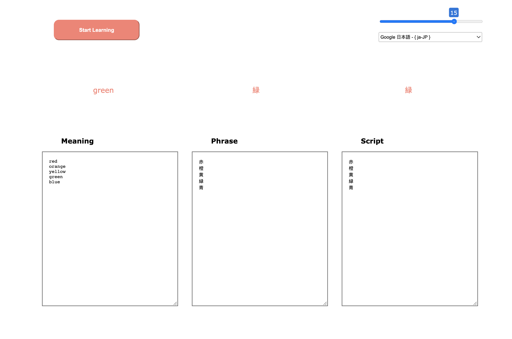

# flashcard study

### V1
- take in 3 user inputs for meaning - phrase - symbol
- parse the inputs by space (single words)
- display 1 set of matching meeaning-phrase-symbol
- cycle through all parsed inputs

### V2
- random input order
- throw error on unequal list length
- grab phrase with regex match single or double quote
- revert styles to white bg

### V3
- display phrase and symbol 2 seconds after meaning

### V4
- text to speech additions with delay time slider and language selection drop down

### V5
- animation time 500ms - min slider 2 seconds
- modules added to load in prewritten learning sets for past present and future tense

### V6
- speed slider control
- style adjustment
- sentence queue

