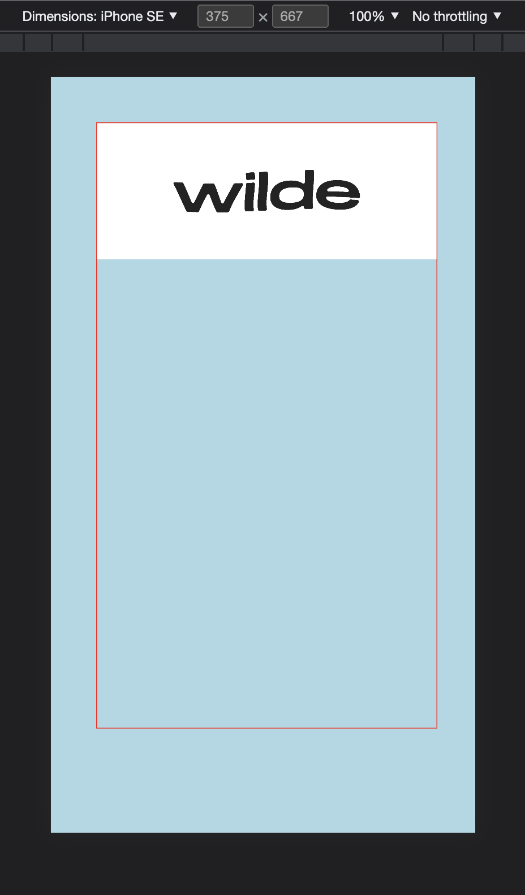

# Fluid text hover
- responsive img generated inside a canvas placed inside an iframe to control size, canvas/img width based off window width (iframe)

## webGL and alpha
 - https://webglfundamentals.org/webgl/lessons/webgl-and-alpha.html

## setting transparent background
- https://stackoverflow.com/questions/58910720/setting-transparent-background-to-this-webgl-with-ogl-flowmap-effect

## images

