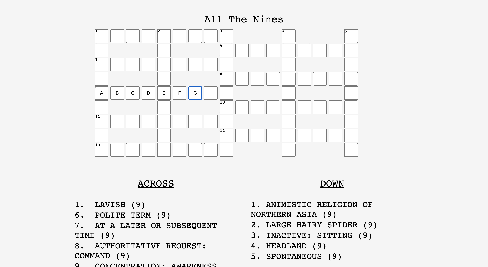

# crossword
### take in answer grid as matrix array and display numbered grid that contain letters with corresponding clues, navigate input boxes with arrow keys

- set up grid printing, hide tiles that dont have letters
- add inputs
- navigate tiles with arrow keys

