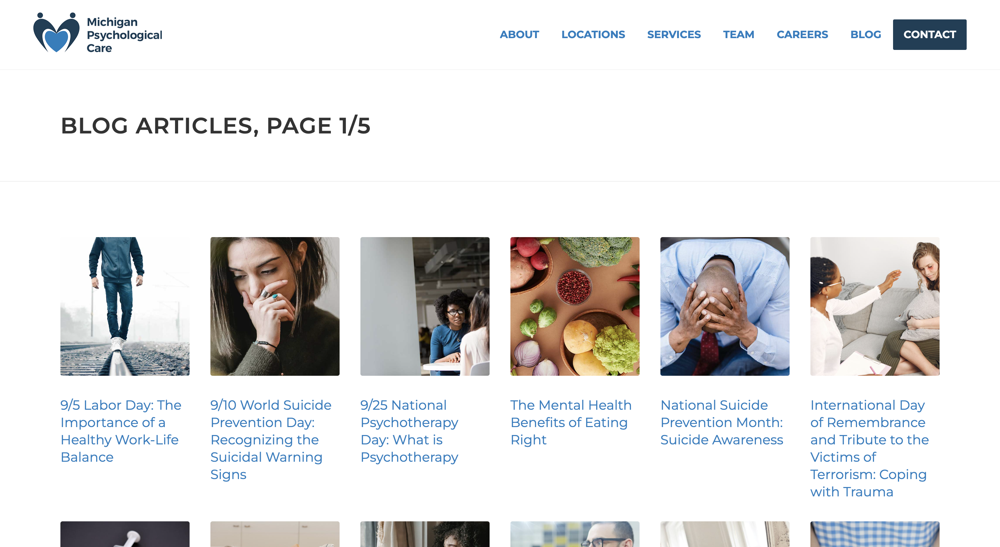

# [MichiganPsychologicalCare.com](https://michiganpsychologicalcare.com/blog.php)

# michigan psychological care
- take in a word doc, convert to html, insert into php article card
- add article to articles folder and link on main blog page
- shift pagination 5 articles newest to oldest
- related article navigation previous and next

## edits
- blog/
- blog/article.php
    - date
    - content
    - related articles
- images/blog/2022/09
- blog 01-02-03-04-05 +5 articles

## images

## jan 2023
- tuesdays (500)
    - 03 - how substance abuse impacts your brain
    - 10 - mental health benefits of physical affection
    - 17 - relationship between your mental health and physical health
    - 24 - signs of codependency
- thursday (1200)
    - 26 - new year new me

## dec 2022
- tuesdays (500)
    - 05 - 5 ways you can voulenteer your teme
    - 12 - greif and christmas time
    - 19 - the mental health benefits of meditation
    - 26 - why we all need a friend
- thursday (1200)
    - 29 - the relationship between spirituality and mental health

## nov 2022
- tuesdays (500)
    - 01 - 5 ways you can practive gratitude
    - 08 - coping with survivors guilt
    - 15 - decluttering your social media
    - 22 - recodnizing the signs of gender based violence
- thursday (1200)
    - 24 - how stress impacts your mental health

## oct 2022
- tuesdays (500)
    - 04 - 10 ways you can support your mental health
    - 11 - do i have depression
    - 18 - how forgiveness can help you find happiness
    - 25 - the benefits of play therapy
- thursday (1200)
    - 27 - understanding your mental health

## sept 2022
- tuesdays (500)
    - 06 - labor day
    - 13 - world suicide
    - 20 - national psychotherapy
    - 27 - mental health eating
- thursday (1200)
    - 29 - national suicide prevention

## aug 2022
- tuesdays (500)
    - 02 - trauma
    - 09 - overdose
    - 16 - relaxation
    - 23 - loved one grief
- thursday (1200)
    - 30 - grief awareness

## july 2022
- tuesdays (500)
    - 05 - affirmations
    - 12 - simplicity
    - 19 - wellness
    - 26 - workaholics
- thursday (1200)
    - 28 - mental health

## june 2022
- tuesdays (500)
    - 07 - healing from the warzone at home
    - 14 - junteenth: healing the racial trauma of the past
    - 21 - knowing when youre ready for addiction therapy
    - 28 - rootless in a work from home world
- thursday (1200)
    - 30 - top mental health concerns in the lgbtq+ community

## may 2022
- tuesdays (500)
    - 03 - how to know when you are ready for counseling
    - 10 - national childrens mental health awareness day(5/5)
    - 17 - the emotional rollercoaster of teenage pregnancy
    - 24 - we need to talk about veteran mental health (military appreciation month)
    - 31 - why telemedicine and mental health work
- thurs (1200)

## arpril 2022
- tuesdays (500)
    - 19 - how do i find a consular near me? counseling awareness month
    - 26 - national autism awareness month(& world autism awareness day, 4/2)
    - 28 - sexual assault awareness/prevention month (& day 4/5)
- thurs (1200)

